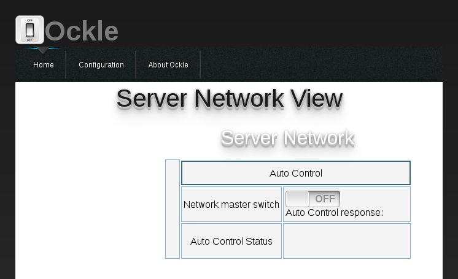

Using Ockle
===========

Running Ockle for the first time
---------------------------------

To run the Ockle simply exacute:

.. code-block:: bash

  ~/pythonenv/bin/python src/MainDaemon.py

Then you can run the GUI:

.. code-block:: bash

  ~/pythonenv/bin/python src/webserer/application.py

Once you have done that you can enter the webserver via `port 8000 <http://localhost:8000>`_ .
You should see the following page:

This it not much, since there are no servers configured yet. You will need to enter the 'configuration' section at the top of the page and add servers to the server network.

