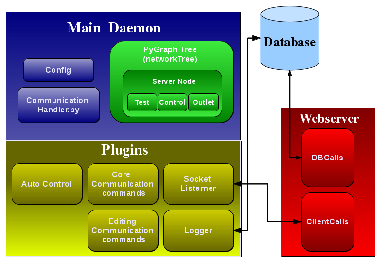

Ockle's Core functions
======================

These are objects that are in the core of Ockle

.. toctree::
   MainDaemon
   networkTree
   CommunicationHandler
   :maxdepth: 4

Ockle's Diagram
---------------

