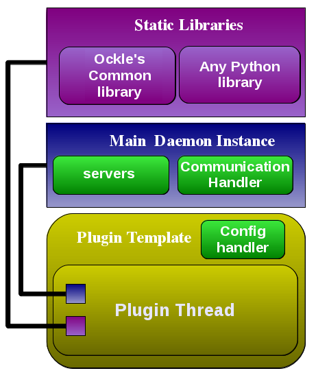

Plugins
=======
.. note:: One of the main concept of Ockle's design is that everything that could be a plugin, should be.

Ockle allows to add major features by the use of plugins. Each plugin is python class that gets executed in its own thread, allowing the developer to add new logic and behavior. You should be able to write a plugin without modifying Ockle's core. But should be able to access any method within it.
Many core functions in Ockle are plugins themselves including the Automatic server control and the communication to the web-based GUI. 

In order to write a plugin, you should know that there are many pre-built tools that would help you in building one. Including a way to place your configuration variables in the GUI from simple `Plugin ini template files`_

A general description of the tools available for the plugin would look like this:

Plugin Framework Diagram
------------------------

Evey plugin is supplied with a pointer to the Main Daemon singletron, allowing access to services such as the server tree data-structure (to change the state of the servers) and the communication handler (which lets you add more commands to the communication with the webserver).
The plugin also gets access to all the functions defined in the plugin template class, such as special functions that arrange the configuration variable storage.

Plugin ini template files
-------------------------

If you want the configuration variable to be changeable at the webserver GUI, you must provide a template ini file in the config folder.
Add example? 

